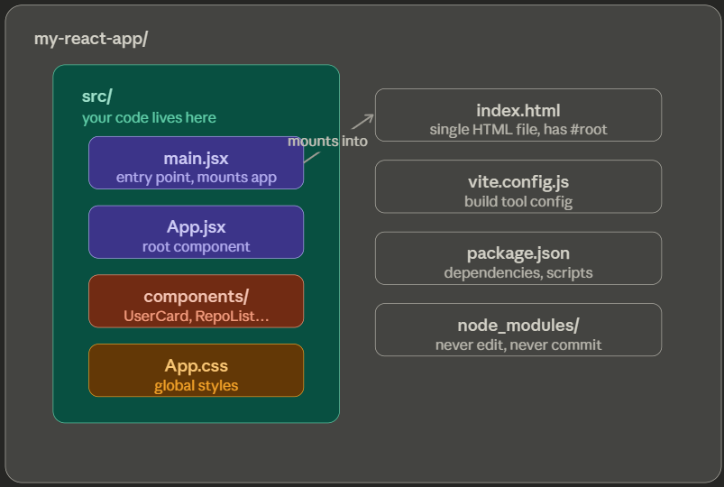

# Day 03 — React Setup (Vite) + JSX + Components

## Topics Covered

| File | Topic | Concepts |
|------|-------|----------|
| `01-jsx-syntax.js` | JSX rules | className, self-closing tags, {}, conditionals, .map() |
| `src/main.jsx` | Entry point | createRoot, StrictMode, mounting to #root |
| `src/App.jsx` | Root component | useState, useEffect, fetch, conditional rendering |
| `src/components/UserCard.jsx` | Component 1 | Props, ternary, short-circuit, template literals |
| `src/components/RepoList.jsx` | Component 2 | .map(), key prop, sub-components, conditional meta |
| `src/App.css` | Styles | Component-scoped CSS |



## Key Takeaways

- Vite scaffolds a React app in seconds — `npm create vite@latest`
- JSX is JS + HTML-like syntax — compiled by Babel/Vite
- `className` not `class`, all tags must close, camelCase attributes
- `{}` embeds any JS expression into JSX
- Props are read-only data passed from parent → child (destructure them!)
- `.map()` renders lists — always add `key` prop with a stable unique ID
- `useState` holds changing data; `useEffect` runs side-effects after render
- `&&` for optional rendering, ternary `? :` for one-or-the-other

## How to Run

```bash
# 1. Create the Vite project
npm create vite@latest my-github-app -- --template react
cd my-github-app
npm install

# 2. Replace the generated files with today's files:
# src/main.jsx        → copy from this folder
# src/App.jsx         → copy from this folder
# src/App.css         → copy from this folder
# src/components/     → create folder, add UserCard.jsx + RepoList.jsx

# 3. Run
npm run dev
# Open http://localhost:5173
```

## Folder Structure

```
my-github-app/
├── index.html              ← has <div id="root">
├── package.json
├── vite.config.js
└── src/
    ├── main.jsx            ← mounts <App /> into #root
    ├── App.jsx             ← root component, fetches GitHub data
    ├── App.css             ← styles
    ├── index.css           ← global reset
    └── components/
        ├── UserCard.jsx    ← shows profile: avatar, name, bio, stats
        └── RepoList.jsx    ← lists repos with name, language, stars
```

## Push to GitHub

```bash
git add .
git commit -m "day 03: Vite + JSX + UserCard + RepoList components"
git push
```

## Status: ✅ Complete